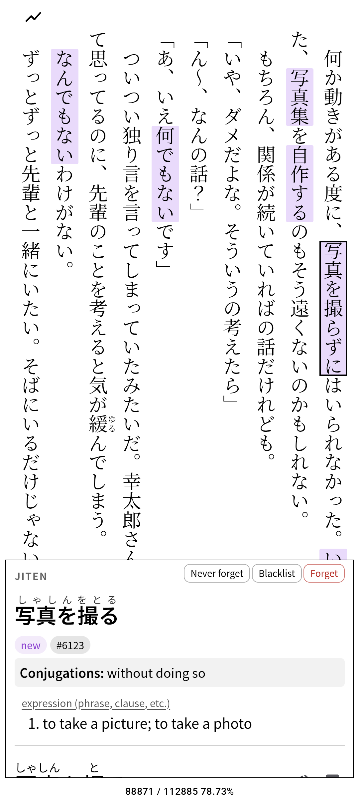
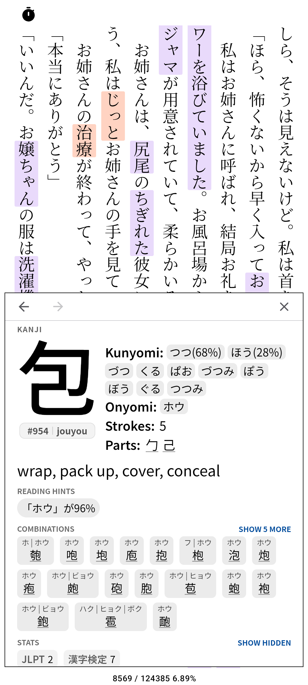
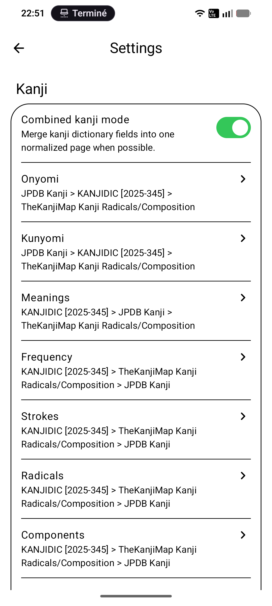
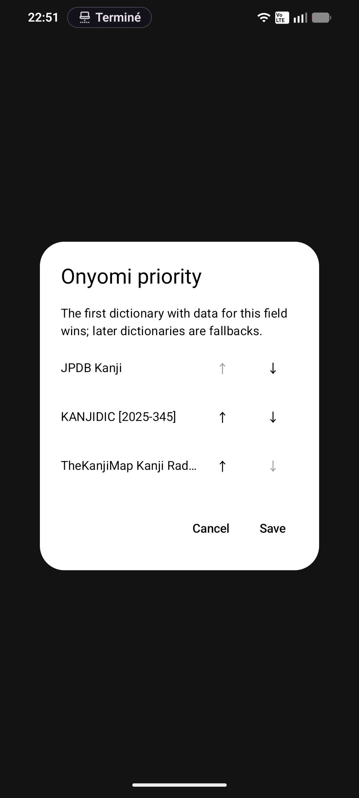
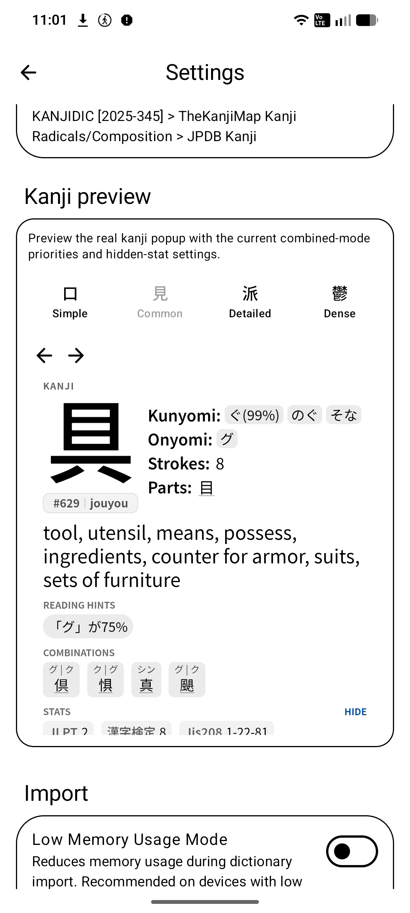
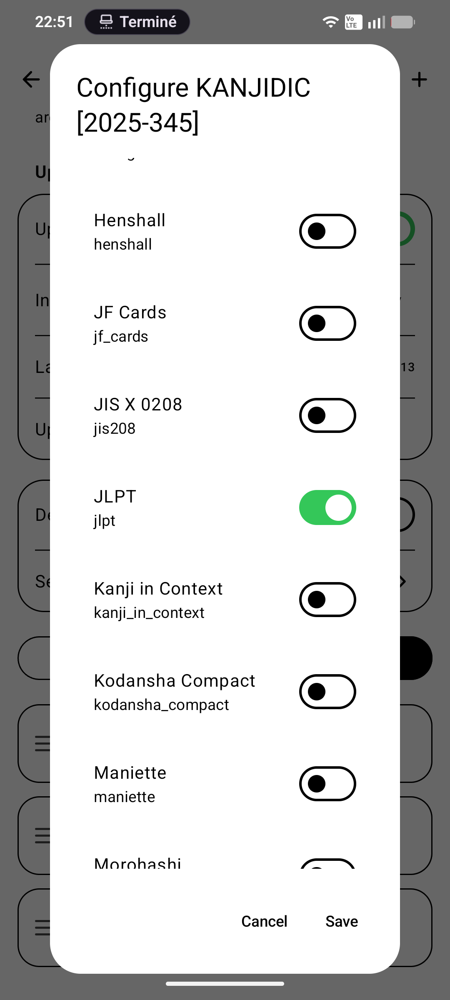
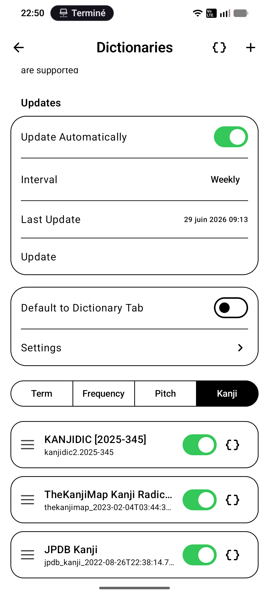

# Hoshi Reader Jiten Fork

Hoshi Reader Jiten Fork is a fork of [Hoshi Reader Android](https://github.com/HuangAntimony/Hoshi-Reader-Android) with Jiten Reader integration added.

Hoshi Reader Android is itself a native Android recreation of [Hoshi Reader](https://github.com/Manhhao/Hoshi-Reader).

This fork is vibe-coded. It focuses mostly on integrating [JitenReader](https://github.com/Sirush/JitenReader)-style parsing, vocabulary status display, and Jiten popup actions into Hoshi Reader Android.

If other feature ideas come up, I will first try to get them integrated into the upstream Android repository when possible, so this fork can inherit them normally. This is not meant to be my personal custom version of Hoshi; it is mainly Hoshi Reader Android with Jiten added.

I do not guarantee day-to-day parity with the official Android repository.

## Jiten Setup

To enable Jiten:

1. Open `Settings`.
2. Go to `Dictionaries`.
3. Open `Settings` again from the dictionaries screen.
4. Find the `Jiten` section.
5. Enable Jiten.
6. Enter your Jiten API key.

This fork uses a different Android package name from the official app:

`com.searaw.hoshireaderjiten`

That means it installs as a separate app. It will not replace the official Hoshi Reader Android app.

Because Android treats it as a separate app, it also has separate app storage. To move your existing Hoshi data to this fork, export your books, dictionaries, TTU bookdata, and settings/backups from the official app, then import them again in this fork. You may also need to re-enter settings that are not included in your export.

## Jiten Features

- Choose which Jiten states are displayed, such as new, young, mature, due.
- Show Jiten either as a secondary popup page or as a section above the normal dictionary definitions.
- Choose the reader marker style:
  - underline,
  - highlight,
  - colored text.
- Use standard Jiten popup actions:
  - Never forget,
  - Blacklist,
  - Forget.

## Kanji Features

This fork also adds kanji dictionary support for Yomitan-style kanji dictionaries, with a cleaner kanji popup layout and a combined display mode.

### Supported Dictionnaries as of v1.2.3 10246:

- KANJIDIC
- TheKanjiMap
- JPDB Kanji

Other dictionnaries should work but will import as raw lists and won't contribute to the layout in combined mode for some fields. 

### What it adds

- Import kanji dictionaries and open kanji pages from dictionary popups.
- Click kanji, radicals, parts, combinations, and linked kanji inside kanji pages to keep exploring.
- Use back/forward navigation when nested kanji pages are opened.
- Display kanji data in a compact visual layout:
  - large kanji,
  - frequency / grade tag,
  - kunyomi,
  - onyomi,
  - strokes,
  - radicals / parts,
  - meanings,
  - combinations,
  - tags and stats.
- Use a combined mode that merges several kanji dictionaries into one cleaner page.
- Choose dictionary priority per field, so one dictionary can be preferred for readings, another for meanings, another for stats, etc.
- Choose which extra stats/fields are shown by default and which stay hidden behind `Show hidden`.
- Preview kanji popup rendering directly from the dictionary settings before testing in the reader.
- Improved non-wide popup placement: the reader now prefers showing popups above/below the selected term more often, instead of squeezing them to the side.

### How to use

1. Import one or more kanji dictionaries from `Settings` > `Dictionaries`.
2. Press "{}" to open each dictionary field/settings popup to choose which extra stats are shown by default.
3. Open the dictionaries settings screen.
4. In the kanji section, enable combined mode if you want one merged kanji page instead of one block per dictionary.
5. Configure field priority sorting to choose which dictionary should provide each kind of data first.
6. Use the kanji preview at the bottom of the settings to check the result live.

### Screenshots

<table>
  <tr>
    <td align="center" width="33%">
      <strong>Kanji popup</strong> 
      
    </td>
    <td align="center" width="33%">
      <strong>Combined mode settings</strong> 
      
    </td>
    <td align="center" width="33%">
      <strong>Combined mode sorting</strong> 
      
    </td>
  </tr>
  <tr>
    <td align="center" width="33%">
      <strong>Kanji preview</strong> 
      
    </td>
    <td align="center" width="33%">
      <strong>Hidden Selection</strong> 
      
    </td>
    <td align="center" width="33%">
      <strong>Kanji Tab</strong> 
      
    </td>
  </tr>
</table>

## Attribution And License

This fork is based on [Hoshi Reader Android](https://github.com/HuangAntimony/Hoshi-Reader-Android), which is licensed under the GNU General Public License v3.0.

Jiten-related behavior is based on [JitenReader](https://github.com/Sirush/JitenReader), which is licensed under the MIT License.

JitenReader copyright:

- Copyright (c) 2025 chinokusari
- Copyright (c) 2026 Sirus

Distributed under the GNU General Public License v3.0. See [LICENSE](LICENSE) for details.
